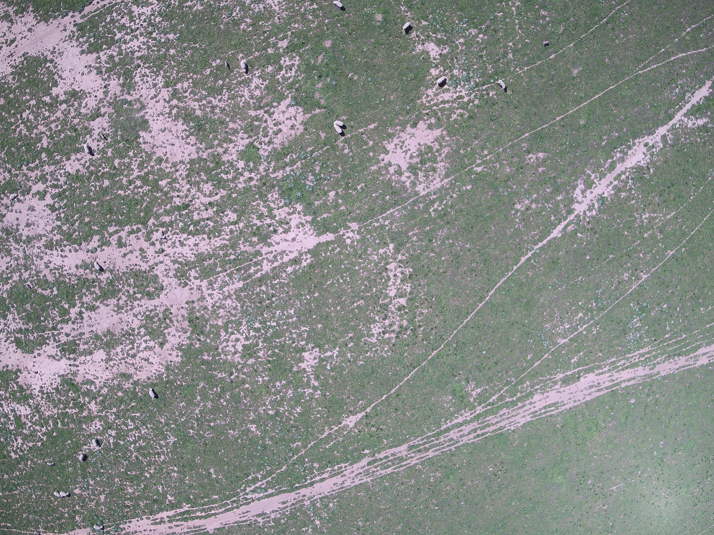
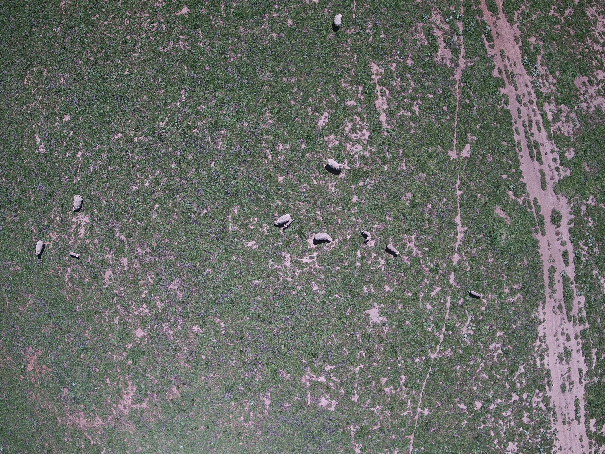
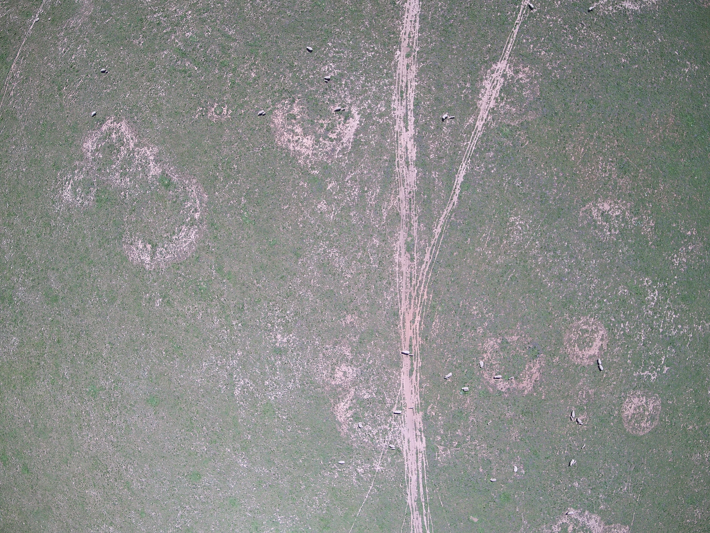
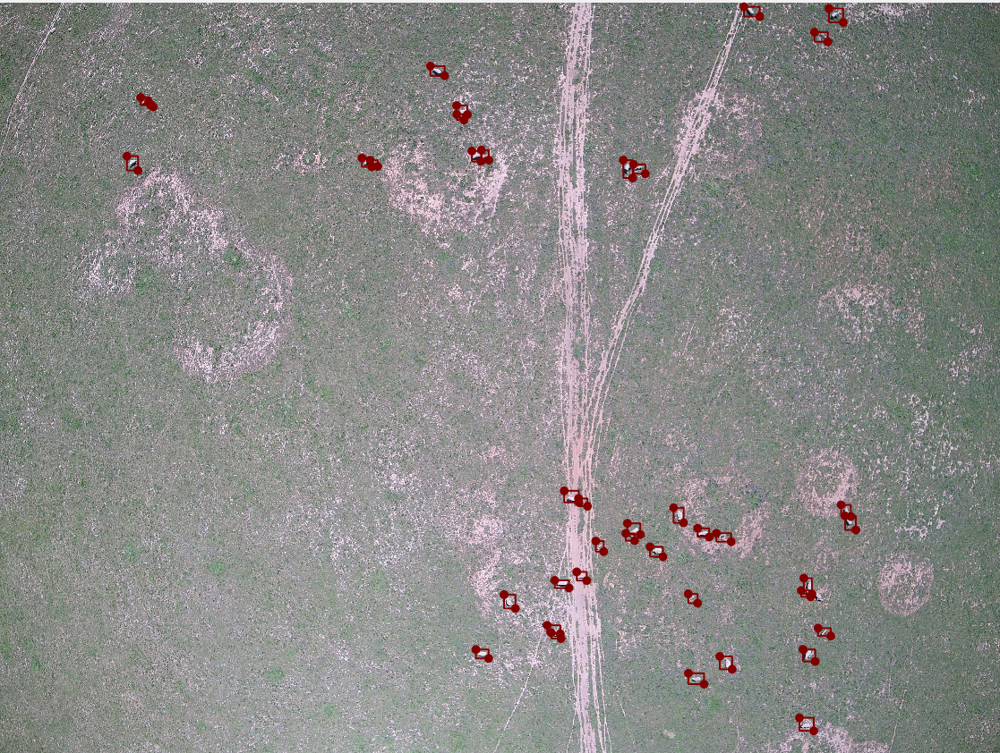
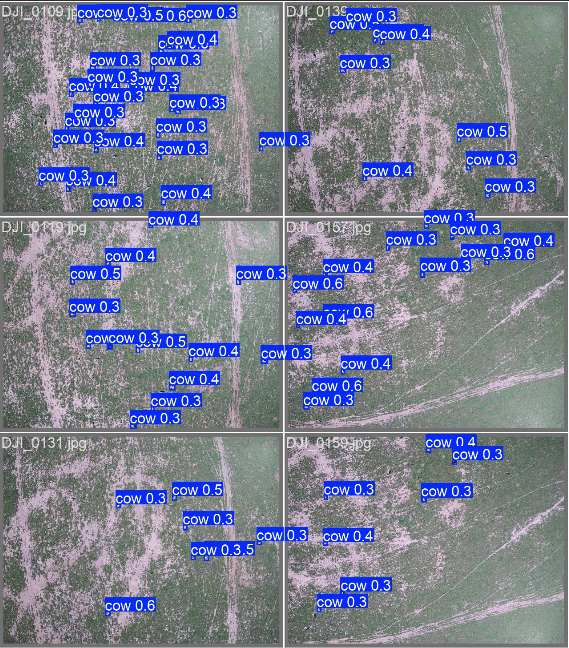
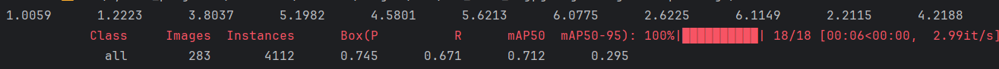

# uav_cow_tracking_counting

## Project Preview
This project is based on YOLOv10 and ByteTrack, trying to track and count cattle on Australian farms from drone-captured videos. Supported by high-resolution cameras, UAVs can fly over groups of cattle in order to capture images, making it possible to create computer vision systems to support the management of cattles and some other animals.

## Materials and methods

### Materials
The dataset used in the project comes from a DJI drone. The drone collected several wide-angle images (resolution 4000 * 3000) and videos at three different altitudes. Some samples are shown below:

The three samples correspond to the images collected by the drone at different altitudes.

### Dataset creation
Generally speaking, it is more straightforward to use the YOLOmark tool to create a YOLO format dataset, but considering that YOLOmark is not very friendly to the annotation of small objects, another annotation tool is used here: Labelme (https://github.com/wkentaro/labelme). This tool was originally used to create semantic segmentation datasets, but it supports the annotation of small objects. The following is a sample image labeled by the labelme tool.

After getting the annotated image, you also need to convert the generated annotation file (JSON format) into YOLO format. I implemented the relevant functions in the utils.py file.

## Research process and problems encountered

### 1. Object detection
I used two models, YOLOv10n and YOLOv10s, with the same training parameters, and trained them on GPU for 100 epochs. Some training parameters are as follows:
 **Parameter**   | **Default Value** |
|-----------------|------------------|
| `batch-size`    | 16               |
| `epochs`        | 100              |
| `img-size`      | 640              |
| `learning-rate` | 0.0001           |
| `momentum`      | 0.937            |
| `weight-decay`  | 0.0005           |
| `optimizer`     | Adam             |                                                           

Here are some prediction results:

### 2. Object tracking and counting
In this project, I used Ultralytics YOLO's built-in tracking head, ByteTrack, for real-time object tracking and counting. ByteTrack was chosen because of its high accuracy and robustness in associating detected objects across frames, making it suitable for tracking cows in UAV videos.
<ul>
<li>
How It Works: ByteTrack works by taking the bounding boxes produced by the YOLO detector and associating them across frames using a combination of spatial features (like bounding box overlap) and temporal motion features (object speed and trajectory). This results in each cow being assigned a unique ID that persists as long as the cow is visible.
</li>
<li>
Integration with YOLO: The tracking was implemented by combining Ultralytics YOLO’s object detection capabilities with ByteTrack’s tracking logic. After each frame’s detections were made, ByteTrack assigned unique IDs to each detected cow, allowing for individual cow tracking.
</li>
</ul>

### Problems encountered
1. Low object detection accuracy  
Since the dataset is drone images, when the drone is flying at a high altitude, the objects in the camera's view will be very small (refer to the Materials section). After calculation, when the drone flies high, the size of the target is usually only 10~144 pixels. This makes it difficult for the model training to converge and the detection effect is not good.
2. Model performance is affected by drone altitude  
The size of the target will change with the change of the flying altitude of the drone, so how to train the model to adapt to different flying altitudes is an important issue; secondly, how to divide the data set is also a problem. The YOLO model is not very effective in detecting small objects, so small object samples need to occupy a larger proportion in the data set.
3. The impact of multiple perspectives on object tracking  
When the drone rotates quickly or switches perspective, the target being tracked may be lost or re-counted, which will affect the accuracy of object counting.

### Solution
1. Wide-angle images taken by drones usually have a lot of space occupied by background or irrelevant areas. Inspired by these two papers:  
   [**An Image is Worth 16x16 Words: Transformers for Image Recognition at Scale**](https://doi.org/10.48550/arXiv.2010.11929)  
   *Alexey Dosovitskiy, Lucas Beyer, Alexander Kolesnikov, Dirk Weissenborn, Xiaohua Zhai, Thomas Unterthiner, Mostafa Dehghani, Matthias Minderer, Georg Heigold, Sylvain Gelly, Jakob Uszkoreit, Neil Houlsby*.  
   [arXiv:2010.11929](https://doi.org/10.48550/arXiv.2010.11929), 2021.  
   
   While the Transformer architecture has become the de-facto standard for natural language processing tasks, its applications to computer vision remain limited. This paper demonstrates that a pure transformer applied directly to sequences of image patches can perform very well on image classification tasks and achieve state-of-the-art results.
      
   [**Focal Loss for Dense Object Detection**](https://doi.org/10.48550/arXiv.1708.02002)  
   *Tsung-Yi Lin, Priya Goyal, Ross Girshick, Kaiming He, Piotr Dollár*  
   [arXiv:1708.02002](https://doi.org/10.48550/arXiv.1708.02002), 2017.  
   This paper proposes the **Focal Loss** to address the extreme foreground-background class imbalance in dense object detection tasks. By down-weighting the loss assigned to well-classified examples, the Focal Loss focuses training on a sparse set of hard examples, which prevents the vast number of easy negatives from overwhelming the detector during training. The authors validate this loss function on RetinaNet, achieving state-of-the-art accuracy compared to two-stage detectors like R-CNN.
     
   In the first article, the author used the vit model to improve the accuracy of the model by focusing on some "important areas"; in the second paper, the author believes that properly adjusting the ratio of background and target is conducive to improving the accuracy of the model. Based on this, I split the (4000 * 3000) image into several small images, annotated and trained.
   
   It turns out that this method is feasible. The map50 of the model increased from about 0.6 to 0.71.  
   
    
   

2. The problem of repeated detection of targets 
   For this problem, I am trying to adjust the parameters of bytetrack. The effect I have achieved so far is that when the drone is flying steadily, the object tracking part can work well.

    
   

## Final effect display

